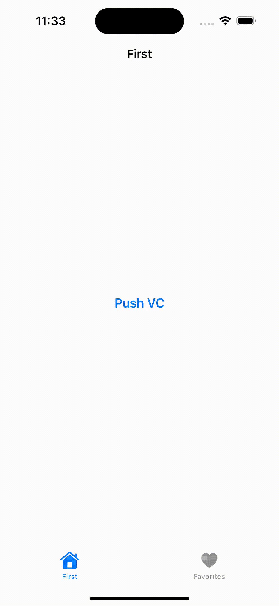

## hidesBottomBarWhenPushed not working in iOS 26 when using UINavigationController

In previous versions of iOS, setting hidesBottomBarWhenPushed = true on a view controller correctly hid the UITabBar when that view controller was pushed onto a UINavigationController that is part of a UITabBarController hierarchy.

However, on iOS 26, this behavior no longer works as expected:
When pushing a view controller with hidesBottomBarWhenPushed = true, the bottom tab bar remains visible, which breaks the expected navigation experience.

| iOS 18             | iOS 26             |
|--------------------|--------------------|
|  |  |
