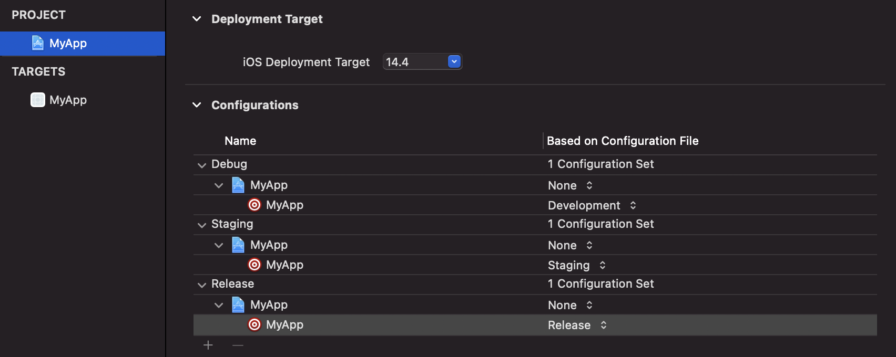

# xcode-configurations-sample

I’ve created two Xcode projects:
1. MyFramework
2. MyApp (iOS app)

and a workspace named MyWorkspace where I’ve added these 2 projects.

I’ve set “MyFramework” as a  framework for the MyApp target (Targets > MyApp > General > Frameworks, Libraries and Embedded Content).

In MyApp, I’ve created 3 empty different Xcode configurations files (Development, Staging and Release) and I’ve configured them like so:

1. Debug uses Development configuration file
2. Staging uses Staging configuration file
3. Release uses Release configuration file

At this point I’ve created a new schema named “MyApp-Staging” where I’ve set the Staging configuration as “Build Configuration” for every action (for the sake of this example)

Now, if I use the default schema “My App” to build and run the project, everything works fine but if I use the schema “My App - Staging” I get a Swift Compiler Error: “No such module ‘MyFramework’”

How can I solve this issue?
Thanks

Answer:

You’re encountering this build error because the framework wasn’t built, as the framework doesn’t have a matching configuration named Staging.
You can resolve this by adding a Staging configuration to the framework’s project.
Generally, all projects should have the same set of configuration names to avoid issues like this, so if you need to add a new configuration to the app in the future, that configuration will need to be run through all of the Xcode projects referenced by the build.

---

Additional info:

- [Swift package product '{SWIFT PACKAGE}' is linked as a static library by '{APP NAME}' and '{EXTENSION NAME}'. This will result in duplication of library code.](https://developer.apple.com/forums/thread/128806)
- [Adding a package to two targets in one projects results in an error](https://forums.swift.org/t/adding-a-package-to-two-targets-in-one-projects-results-in-an-error/35007/15)